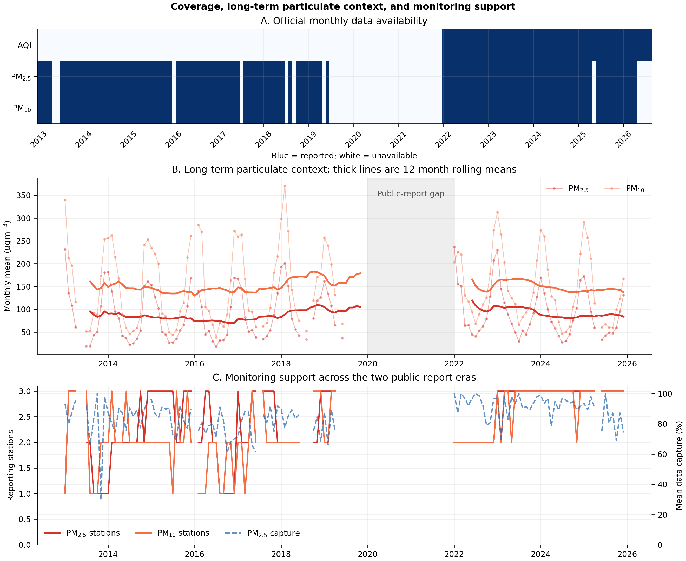
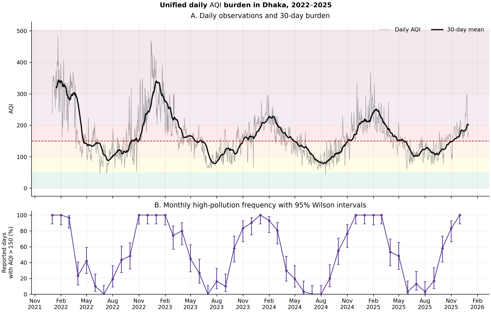
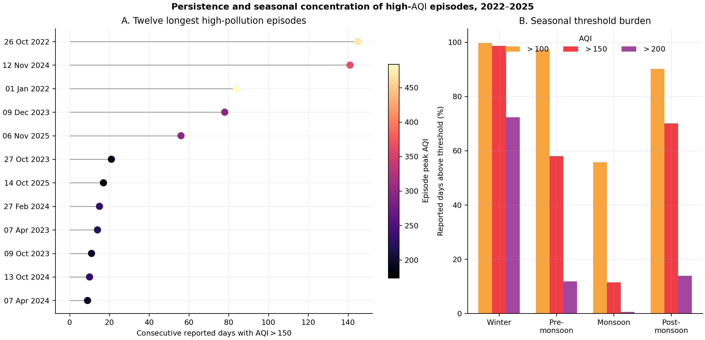
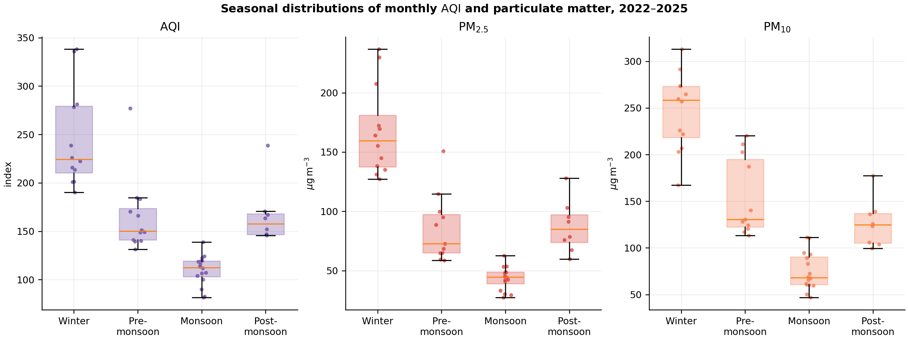
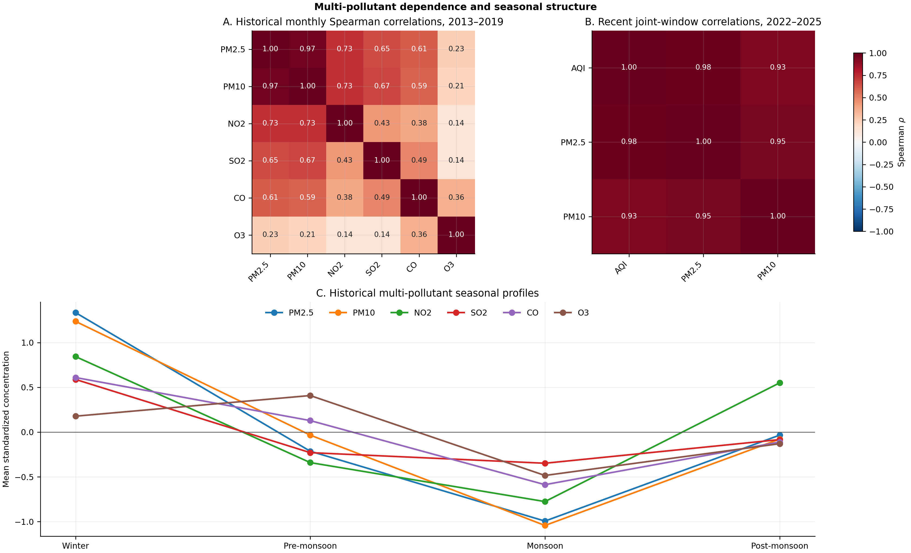
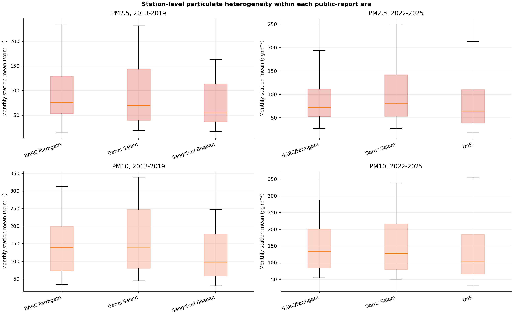
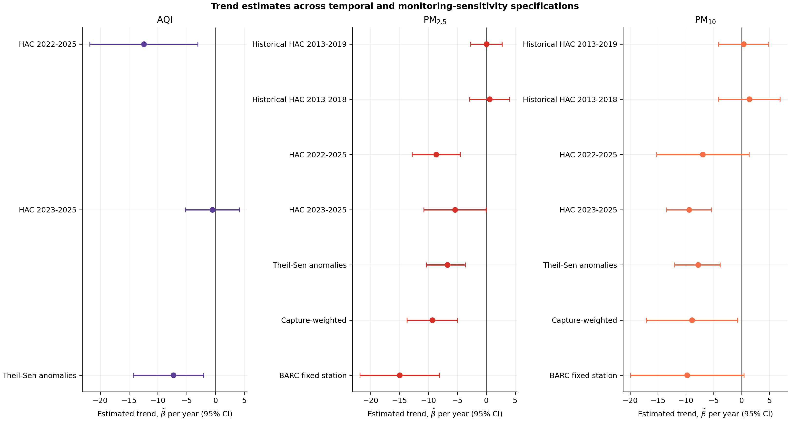
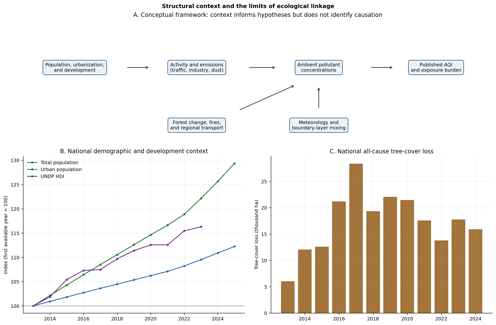

# Severe and Persistent Air Pollution in Dhaka: An Integrated Official-Source Analysis of Daily Burden, Monitoring Heterogeneity, Multi-Pollutant Structure, and Temporal Change, 2013–2025

**Awnon Bhowmik**

*Department of Computer Science and Engineering, Colorado Technical University*

awnonbhowmik@outlook.com

## Abstract

**Background.** Dhaka’s air pollution is widely recognized as a major environmental-health problem, yet public analyses often combine data with uncertain provenance, overlook changes in monitoring support, or infer long-term and causal relationships from short or geographically mismatched series. We assembled an auditable record from Bangladesh Department of Environment (DoE) daily air-quality index (AQI) reports and monthly monitoring summaries, then connected these observations with national demographic, development, and tree-cover context under an explicit non-causal framework.

**Methods.** The study used complementary analysis windows. Resolved-unit monthly pollutant observations from 2013–2019 provided historical particulate and gaseous-pollutant context; AQI, PM₂.₅, and PM₁₀ were analyzed jointly for 2022–2025. A unified daily AQI series for 2022–2025 selected either monthly-report Table 6 or the standalone daily archive for each month according to the source-completeness rule used in the monthly dataset. Source concordance was quantified on overlapping days. We estimated seasonal burden, threshold frequencies, consecutive high-pollution episodes, station-paired contrasts, cross-pollutant Spearman correlations, and month-adjusted trends with heteroskedasticity- and autocorrelation-consistent standard errors. Trend sensitivity analyses varied the temporal boundary, estimator, station weighting, and fixed-station restriction. Bangladesh population, urbanization, Human Development Index (HDI), and tree-cover loss were summarized as structural context but were not entered into Dhaka pollution models.

**Results.** The unified daily series contained 1,457 of 1,461 calendar days. Annual mean AQI ranged from 150.1 in 2024 to 197.3 in 2022; AQI > 150 occurred on 48.1%–56.7% of reported days by year. Winter mean daily AQI was 245.6, and 98.6% of winter days exceeded 150. The longest high-pollution episode lasted 145 days from 26 October 2022 through 19 March 2023, peaked at AQI = 469, and accumulated 15,672 index units above 150. On 885 overlapping days in the analysis period, the two daily sources agreed exactly on approximately 94% of values and were correlated at approximately r = 0.99. During 2022–2025, monthly AQI correlated strongly with PM₂.₅ (ρ = 0.981) and PM₁₀ (ρ = 0.935). All 974 selected standalone reports with a stated responsible pollutant during 2023–2025 identified PM₂.₅. Historical 2013–2019 particulate trends were near zero, whereas the 2022–2025 month-adjusted PM₂.₅ slope was −8.7 µg m⁻³ year⁻¹ (95% CI: −12.8 to −4.5). The recent AQI slope changed from −12.4 units per year over 2022–2025 to −0.6 over 2023–2025. Station contrasts showed systematically higher recent PM₂.₅ at Darus Salam than at BARC/Farmgate or DoE.

**Conclusions.** Dhaka’s official record documents a severe, particulate-dominated, and highly persistent dry-season exposure regime. The evidence supports possible recent PM₂.₅ improvement but not an established long-term citywide decline. A credible policy-evaluation system requires continuous daily concentrations, stable station metadata, explicit units, meteorology, emissions, and spatially matched population and land-cover data.

**Keywords:** Dhaka; air quality index; PM₂.₅; PM₁₀; time series; pollution episodes; monitoring network; source concordance; urbanization; tree-cover loss

## 1. Introduction

Ambient air pollution is a leading environmental threat because fine particles can penetrate deeply into the respiratory tract and contribute to cardiovascular, respiratory, and other adverse outcomes. Multiple lines of epidemiological evidence connect short- and long-term fine-particle exposure with cardiopulmonary morbidity and mortality (Pope & Dockery, 2006; Burnett et al., 2018; Landrigan et al., 2018). The World Health Organization’s 2021 global guidelines treat PM₂.₅, PM₁₀, nitrogen dioxide (NO₂), sulfur dioxide (SO₂), ozone (O₃), and carbon monoxide (CO) as distinct pollutants with different exposure metrics and health implications (World Health Organization, 2021). The guidelines are health-based reference values rather than a substitute for national standards or a formula for converting concentrations into a single index.

Dhaka-specific epidemiological evidence makes this general health concern locally concrete. Short-term PM₂.₅ exposure has been associated with cardiovascular emergency visits in Dhaka (Khan et al., 2019), reduced lung function among schoolchildren (Tasmin et al., 2019), and increased respiratory emergency visits, with evidence that source composition modifies risk (Rahman et al., 2022). Measurements in Dhaka homes have also shown outdoor-to-indoor particle penetration and associations between fine particles and lung function, underscoring that ambient pollution can contribute to exposure beyond time spent outdoors (Akther et al., 2019). These studies do not convert the present descriptive burden estimates into attributable cases, but they establish why sustained high-index episodes are consequential rather than merely statistical extremes.

Dhaka presents an unusually complex monitoring and policy setting. Population growth, urban expansion, traffic, construction, industry, road dust, household combustion, waste burning, brick production, and regional transport can all contribute to ambient pollution. Their influence is modified by rainfall, wind, temperature, atmospheric mixing, and seasonal activity. The Bangladesh National Air Quality Management Plan 2024–2030 consequently identifies multiple contributing sectors and emphasizes coordinated monitoring and emission reduction rather than a single-source explanation (Department of Environment, 2024).

Dhaka’s research record also supplies a long observational baseline. Early winter measurements and modeling identified spatially concentrated sulfur and nitrogen pollution near industrial, road, and brick-production areas (Azad & Kitada, 1998). Fine-particle composition studies subsequently implicated traffic, kilns, combustion, and long-range transport (Begum et al., 2013), while multi-station analysis documented large winter–monsoon contrasts, spatial gradients, and particulate matter as the dominant criteria-pollutant concern (Rahman et al., 2019). Begum and Hopke (2018) found that long-term air-quality change could remain limited even as economic activity and emission sources expanded.

Later studies have refined the seasonal and regional interpretation. Lemou et al. (2020) documented strong winter–monsoon differences and contributions from both local combustion and transported biomass-burning pollution. Carbon-isotope evidence showed that winter black carbon reflected both fossil and biomass combustion and supported regional control alongside local traffic measures (Salam et al., 2021). Nationwide station analysis found that temperature, humidity, wind, and lagged meteorological conditions influence particulate variation differently across seasons and cities (Islam et al., 2023). Observation–model comparisons for Dhaka reproduced the seasonal regime, identified episodes exceeding 80 days, and estimated a substantial transboundary contribution (Sarwar et al., 2023).

Chemical and source-apportionment evidence further cautions against a single-source explanation. Rahman et al. (2021) identified marked seasonal variation in PM₂.₅ elemental composition and source profiles. Short intensive sampling studies have separately identified soil or road dust, sulfur-rich petroleum, heavy-oil combustion, industry, non-exhaust emissions, vehicles, and waste combustion as plausible contributors, while also detecting local and transboundary influence (Jawaa et al., 2024; Rahat et al., 2025). Guttikunda et al. (2013) modeled substantial contributions from Greater Dhaka brick-kiln clusters. More recent field and experimental work has connected kiln exposure with respiratory outcomes and demonstrated that operational improvements can reduce kiln energy use and emissions (Brooks et al., 2023; Brooks et al., 2025). These studies support mechanistic hypotheses, but they do not authorize attributing each high DoE observation to a specific source.

The principal challenge for a new analysis is therefore not a lack of statistical methods; it is maintaining comparability. The public DoE archive contains different report formats, a 2020–2021 gap in linked monthly reports, changing station composition, partial years, duplicate daily attachments, and recent summary tables in which pollutant units are not always explicit. Numeric monthly AQI begins in 2022, while particulate and gaseous monthly summaries extend to 2013. The standalone daily archive begins later than daily tables embedded in the monthly reports. A single smooth series constructed without recognizing these boundaries would appear comprehensive while silently combining different evidence bases.

This study uses a layered design to exploit the breadth of the archive without erasing those differences. It addresses six questions:

1. How complete and internally concordant are the available DoE daily and monthly sources?
2. How large, frequent, seasonal, and persistent was Dhaka’s daily AQI burden during 2022–2025?
3. What do the two public-report eras show about particulate burden and temporal change?
4. How much do station location, station availability, and data capture affect city-level particulate summaries?
5. What historical multi-pollutant relationships and seasonal profiles are visible when analysis is restricted to resolved-unit observations?
6. How can demographic development and tree-cover loss be connected to the pollution record as structural context without committing ecological or causal overreach?

The contribution is both substantive and methodological. Substantively, the analysis characterizes four nearly complete years of daily burden and twelve years of discontinuous monthly evidence. Methodologically, it retains observation-level source URLs and hashes, validates overlapping daily sources, distinguishes AQI from concentration, incorporates monitoring-support uncertainty, and makes the limits of cross-dataset linkage explicit.

## 2. Methods

### 2.1 Study design and source acquisition

We conducted an observational time-series analysis of public DoE reports for Dhaka. The extraction pipeline discovered attachments from the official daily AQI and monthly air-quality archive pages. Each source file was downloaded into temporary storage, checked for a valid PDF or DOCX signature, hashed with SHA-256, parsed into structured records, validated, and deleted after successful output generation. The processed source manifest retains archive page, report URL, source type, digest, retrieval time, download status, and extraction status. This design avoids retaining more than 600 MB of duplicate reports while keeping a reproducible lineage record.

Daily standalone reports contain a published city AQI, responsible pollutant, source-reported category, and comments. Monthly reports contain daily city AQI values in Table 6 and station-level summaries for PM₂.₅, PM₁₀, NO₂, SO₂, CO, and O₃. Available station statistics include averages, minima, maxima, data capture, and exceedance fields. The city monthly pollutant value was defined as the unweighted mean of reporting-station monthly averages; station count and mean capture were retained beside every value.

### 2.2 Analysis windows and missingness

Linked monthly reports were available for 2013–2019 and from 2022 onward. No continuous linked monthly series was available for 2020–2021. The historical resolved-unit multi-pollutant analysis therefore used 2013–2019. Particulate evidence was summarized separately for 2013–2019 and 2022–2025. Numeric monthly AQI began in January 2022, so the joint monthly AQI–particulate analysis used January 2022–December 2025. Partial 2026 data remain in processed files and coverage graphics but were excluded from estimates.

Source-reported `DNA`, `NA`, and blank values remained missing. Months and days were not imputed. A missing calendar day ended a pollution episode. The main tables report observed denominators so that an exceedance percentage cannot be mistaken for a complete-calendar percentage when coverage is incomplete.

### 2.3 Unified daily AQI construction and concordance

For every month from January 2022 through December 2025, the monthly dataset identifies whether monthly-report Table 6 or the standalone daily archive supplies more valid daily observations; ties favor Table 6. The unified daily series applied the same selection to the underlying daily records. This produced a single source basis per month while preserving each selected record’s URL and SHA-256 digest.

The sources overlap from February 2023 onward. For days with nonmissing values in both sources, we calculated exact agreement, mean absolute difference (MAD), root-mean-square difference (RMSD), Pearson correlation, and maximum absolute discrepancy. The twenty largest disagreements were retained as an audit table. Concordance was treated as measurement validation, not as evidence that every duplicate was interchangeable.

### 2.4 Burden, category, and episode metrics

Annual and seasonal daily burden included mean, median, maximum, and counts above AQI thresholds of 100, 150, and 200. Monthly proportions above 150 were accompanied by Wilson 95% confidence intervals. The thresholds are analytical cut points used consistently across the study; source-reported categories were tabulated separately because labels and category schemes changed across reports.

A high-pollution episode was defined as consecutive reported calendar days satisfying daily AQI > 150. For an episode containing day set $\mathcal{D}$, cumulative excess was

$$
E_{150}=\sum_{d\in\mathcal{D}}\max\!\left(\mathrm{AQI}_d-150,0\right).
$$

Episode summaries included start and end dates, duration, mean, peak, and E₁₅₀. An episode touching the first or final day of the analysis window was described as boundary-censored because its true duration could extend beyond observation.

### 2.5 Monthly burden and seasonal comparisons

Core monthly outcomes were mean AQI, PM₂.₅, and PM₁₀. Seasons were winter (December–February), pre-monsoon (March–May), monsoon (June–September), and post-monsoon (October–November). We calculated means, standard deviations, medians, quartiles, minima, and maxima. Seasonal means received percentile bootstrap 95% confidence intervals from 5,000 fixed-seed resamples. Kruskal–Wallis tests compared the four seasonal distributions; Benjamini–Hochberg *q*-values controlled the false-discovery rate across the three core outcomes.

### 2.6 Station heterogeneity and monitoring support

Station names were harmonized conservatively: BARC/Farmgate, Darus Salam, Sangshad Bhaban, and DoE remained distinct. Sangshad Bhaban was not assumed to be interchangeable with the later DoE label. Within each era and particulate size fraction, we summarized station-specific monthly distributions and data capture. For every station pair, analysis was restricted to months observed at both stations. The paired monthly difference was

$$
\Delta_{ij,t}=C_{i,t}-C_{j,t},
$$

where $C_{i,t}$ is the station monthly average. Mean differences received bootstrap 95% confidence intervals, and Spearman correlations described whether station time series moved together. These comparisons separate synchronized seasonal movement from differences in level.

### 2.7 Historical gases and cross-pollutant structure

Historical NO₂, SO₂, CO, and O₃ were analyzed only for 2013–2019 months whose units were resolved from source tables. Recent gases remained in the source workbook but were excluded from concentration comparisons when summary-table units were unresolved. For scale-free comparison, seasonal profiles were standardized within pollutant:

$$
z_{p,t}=\frac{x_{p,t}-\bar{x}_p}{s_p}.
$$

Pairwise Spearman correlations were estimated among the six historical pollutants and among AQI, PM₂.₅, and PM₁₀ in the recent joint window. Pairwise deletion preserved all usable months, and *n* was reported for every coefficient. Correlation was interpreted as shared temporal structure, not source identity or causation.

### 2.8 Temporal trends and sensitivity analyses

Within each defensible era, the principal monthly trend model was

$$
y_t=\beta_0+\beta_1t+\sum_{m=2}^{12}\gamma_m I(M_t=m)+\varepsilon_t,
$$

where *t* is continuous time in years, $I(M_t=m)$ is a calendar-month indicator, and $\beta_1$ is the annualized slope. Heteroskedasticity- and autocorrelation-consistent covariance estimates with three lags addressed short-range residual dependence. We reported $\hat{\beta}_1$, 95% confidence intervals, nominal *p*-values, and Benjamini–Hochberg *q*-values across the core trend specifications.

Historical particulate models were fitted for 2013–2019 and repeated for 2013–2018 to exclude partial 2019. Recent core models used 2022–2025 and were repeated for 2023–2025 to test baseline dependence. Theil–Sen slopes on calendar-month anomalies provided a robust estimator. Particulate models were also repeated using capture-weighted station averages and the near-complete BARC/Farmgate fixed-station series. No trend bridged the 2020–2021 gap, and no COVID-19 effect was estimated.

### 2.9 Demographic, development, and forest context

National total population, urban population, and urban share were taken from United Nations World Urbanization Prospects 2025 for 2013–2025. Selected Worldometer rows were retained as a transparent cross-check of the underlying UN total-population estimates, not as an independent demographic dataset. Urban values from the two presentations were not compared analytically because their definitions differ.

The official current UNDP observation-year HDI series was used through 2023. Values labeled 2024 or 2025 in the retained secondary workbook were not treated as same-year observations when the lineage indicated forwarding or publication-year confusion. Annual Bangladesh tree-cover loss for 2001–2024 came from Global Forest Watch via Our World in Data. It represents all-cause stand-replacement disturbance detectable in 30 m pixels and is not synonymous with permanent deforestation.

Figure 8 formalizes the assumed conceptual pathway: demographic and development conditions may influence activity and emissions; forest change, fires, and regional transport may influence the regional pollution mixture; meteorology modifies transport, removal, and mixing; ambient concentrations influence the published AQI and exposure burden. The available context variables are national and annual, whereas pollution outcomes are Dhaka-specific and monthly or daily. We therefore plotted synchronized trajectories but did not regress Dhaka pollution on national population, HDI, or forest loss. Such a regression would mix geographic scales, use a very small number of years, and risk spurious association among trending series.

### 2.10 Reproducibility

The pipeline was implemented in Python using pandas, SciPy, statsmodels, Matplotlib, openpyxl, and python-docx. All analysis tables are written to `analysis/dhaka_doe_analysis.xlsx`; figures are generated from code; the Markdown manuscript is converted to formatted DOCX and PDF. Acceptance tests verify source lineage, workbook structure, context definitions, the unified daily period, longest episode, figure inventory, and the absence of deprecated exploratory outputs. A daily updater compares the live archive with the retained manifest and reruns extraction, analysis, figures, and tests only when the source inventory changes.

## 3. Results

### 3.1 Archive composition, coverage, and source agreement

The processed archive contained 1,183 standalone daily attachments and 129 monthly attachments. All daily attachments and 121 monthly reports extracted with `ok` status; eight monthly reports were partial because at least one pollutant block was not parsed. There were 74 retained warnings—66 from daily-record validation and eight from monthly-record validation—but no failed source extraction.

The historical era contributed 71 monthly observations for each particulate series, compared with 84 possible calendar months; 2019 ended in May for the linked public record. The recent joint window contained 48 monthly AQI observations and 47 observations for each particulate series. The unified daily series contained 365 days in 2022, 363 in 2023, 366 in 2024, and 363 in 2025: 1,457 of 1,461 calendar days, or 99.7% overall.

**Table 1. Principal evidence layers and analytical roles.**

| Evidence layer | Period | Observations | Primary analytical role | Principal limitation |
|---|---:|---:|---|---|
| Resolved-unit monthly pollutants | 2013–2019 | 67–72 months per pollutant | Historical burden, gases, seasonality, correlations, trends | Partial boundary years and changing station support |
| Recent monthly AQI | 2022–2025 | 48 months | Joint burden, seasonality, recent trend | Short four-year window |
| Recent monthly particulate matter | 2022–2025 | 47 months per fraction | Joint burden, station and trend sensitivity | One unavailable month; changing network |
| Unified daily AQI | 2022–2025 | 1,457 days | Thresholds, episodes, annual and seasonal burden | Four missing days; source selected by month |
| Standalone daily metadata | 2023–2025 | 974 selected reports | Published categories and responsible pollutant | Does not cover all 2022–2025 daily values |
| National structural context | 2013–2025 | Annual | Demographic/development/forest context | Geographic and temporal mismatch with Dhaka outcomes |

On overlapping nonmissing days during 2023–2025, the monthly-report and standalone sources exhibited approximately 94% exact agreement, an MAD of approximately one AQI unit, and correlation near 0.99. Most disagreement was concentrated in a small number of dates: the RMSD was larger than the MAD, and the maximum difference was 79 units. The month-level completeness rule prevented arbitrary day-by-day source switching, while the discrepancy table preserved those exceptions for audit.

**Figure 1.** Panel A distinguishes the long monthly pollutant record from the shorter numeric AQI record. Panel B shows particulate observations and within-era rolling means; the shaded area marks the 2020–2021 public-report gap. Panel C displays changing station counts and mean PM₂.₅ data capture. Lines never bridge the gap. Partial 2026 availability is shown only for provenance.

### 3.2 Daily AQI burden during 2022–2025

Annual mean AQI was highest in 2022 at 197.3 and lowest in 2024 at 150.1. The median remained between 148 and 162 across all four years, showing that the year-to-year mean difference was influenced partly by extreme high days. At least 280 reported days per year exceeded 100. More than half of reported days exceeded 150 in 2022, 2023, and 2025; the proportion was 48.1% in 2024. Days above 200 declined from 137 in 2022 to 61 in 2025, but the decline was not monotonic because 2024 had 72 such days.

**Table 2. Annual daily AQI burden.**

| Year | Reported days | Coverage | Mean | Median | Maximum | Days >100 | Days >150 | Share >150 | Days >200 |
|---:|---:|---:|---:|---:|---:|---:|---:|---:|---:|
| 2022 | 365 | 100.0% | 197.3 | 162 | 484 | 311 | 207 | 56.7% | 137 |
| 2023 | 363 | 99.5% | 160.5 | 159 | 392 | 300 | 206 | 56.7% | 71 |
| 2024 | 366 | 100.0% | 150.1 | 148 | 335 | 280 | 176 | 48.1% | 72 |
| 2025 | 363 | 99.5% | 159.3 | 158 | 367 | 315 | 205 | 56.5% | 61 |

Seasonal aggregation revealed a stable exposure regime beneath annual fluctuation. Winter mean daily AQI was 245.6; 99.7% of reported winter days exceeded 100, 98.6% exceeded 150, and 72.3% exceeded 200. Monsoon mean AQI was 109.7, with 11.5% of days above 150 and 0.6% above 200. Pre-monsoon and post-monsoon were not clean transition periods: 58.0% and 70.1% of their reported days exceeded 150, respectively.

**Figure 2.** Panel A shows unified daily AQI and a 30-day rolling mean against descriptive category bands. Panel B shows the monthly share of reported days with AQI > 150 and Wilson 95% confidence intervals. Source selection is fixed within each month and follows the monthly completeness rule.

Standalone report metadata reinforced the particulate interpretation. All 974 selected 2023–2025 records containing a responsible pollutant named PM₂.₅, across every season and year. This field identifies the pollutant controlling the published index, not a complete chemical or emissions-source decomposition. Source-reported category labels also changed: “caution” appeared in 2023–2024, while “unhealthy for sensitive group” appeared prominently in 2025. For this reason, cross-year burden comparisons were based on numeric thresholds rather than category text.

### 3.3 Episode persistence and cumulative burden

The unified series contained 87 episodes with AQI > 150. The longest lasted 145 consecutive reported days, from 26 October 2022 through 19 March 2023. Its mean AQI was 258.1, peak was 469, and cumulative excess was E₁₅₀ = 15,672. The second-longest lasted 141 days from 12 November 2024 through 1 April 2025. A boundary-censored 84-day episode occupied 1 January–25 March 2022, with mean 308.7 and peak 484; its true start preceded the analysis window.

**Table 3. Five longest observed AQI > 150 episodes.**

| Start | End | Duration | Mean AQI | Peak AQI | E₁₅₀ | Censoring note |
|---|---|---:|---:|---:|---:|---|
| 26 Oct 2022 | 19 Mar 2023 | 145 | 258.1 | 469 | 15,672 | Fully observed |
| 12 Nov 2024 | 1 Apr 2025 | 141 | 210.9 | 367 | 8,583 | Fully observed |
| 1 Jan 2022 | 25 Mar 2022 | 84 | 308.7 | 484 | 13,333 | Left-censored |
| 9 Dec 2023 | 24 Feb 2024 | 78 | 213.3 | 296 | 4,936 | Fully observed |
| 6 Nov 2025 | 31 Dec 2025 | 56 | 191.6 | 298 | 2,332 | Right-censored |

Episode ranking demonstrates why annual means alone are insufficient. The 2022–2023 episode had only four more days than the 2024–2025 event but almost twice the cumulative excess because its mean and peak were much higher. Conversely, numerous short episodes contributed limited cumulative burden even when an isolated peak was high.

**Figure 4.** Panel A ranks the twelve longest observed episodes; color represents episode peak. Panel B gives the seasonal proportions above 100, 150, and 200. Missing dates break an episode, and boundary episodes may be longer than observed.

### 3.4 Monthly particulate burden and seasonality

During 2022–2025, mean monthly AQI was 167.0 (SD 62.2; median 149.0), mean PM₂.₅ was 92.4 µg m⁻³ (SD 54.3; median 72.7), and mean PM₁₀ was 146.0 µg m⁻³ (SD 74.3; median 124.6). The three outcomes moved together, but they are not interchangeable: AQI is a dimensionless maximum-based communication index, whereas particulate values are concentrations averaged across reporting stations.

**Table 4. Recent seasonal monthly burden.**

| Outcome | Unit | Season | Months | Mean | Bootstrap 95% CI | Median |
|---|---|---|---:|---:|---:|---:|
| AQI | index | Winter | 12 | 245.3 | 219.8–274.6 | 224.2 |
| AQI | index | Pre-monsoon | 12 | 165.3 | 148.0–189.4 | 150.1 |
| AQI | index | Monsoon | 16 | 109.8 | 102.5–117.0 | 112.6 |
| AQI | index | Post-monsoon | 8 | 166.4 | 150.6–189.0 | 157.8 |
| PM₂.₅ | µg m⁻³ | Winter | 12 | 167.7 | 148.6–188.9 | 159.6 |
| PM₂.₅ | µg m⁻³ | Monsoon | 16 | 43.5 | 39.0–47.8 | 44.6 |
| PM₁₀ | µg m⁻³ | Winter | 12 | 246.5 | 223.5–268.1 | 258.5 |
| PM₁₀ | µg m⁻³ | Monsoon | 16 | 74.7 | 65.5–84.4 | 68.0 |

Winter monthly means were approximately 3.9 times the monsoon mean for PM₂.₅ and 3.3 times for PM₁₀. Seasonal distributions differed strongly for AQI (H = 38.71), PM₂.₅ (H = 38.92), and PM₁₀ (H = 38.52); all three satisfied q < 0.001. The magnitude and repeatability of the cycle indicate that seasonality is not a nuisance to be smoothed away but a central feature of exposure.

**Figure 3.** Monthly AQI, PM₂.₅, and PM₁₀ distributions during 2022–2025. Points are months; boxes show median and interquartile range. Units are pollutant-specific.

### 3.5 Historical multi-pollutant evidence

During 2013–2019, the monthly means were 87.3 µg m⁻³ for PM₂.₅, 152.0 µg m⁻³ for PM₁₀, 54.0 ppb for NO₂, 9.8 ppb for SO₂, 1.87 ppm for CO, and 7.23 ppb for O₃. These values describe resolved-unit source tables only; they do not validate unresolved recent gas entries by analogy.

The historical seasonal structure was broad rather than particulate-only. Winter means were 160.6 for PM₂.₅, 259.5 for PM₁₀, 82.4 ppb for NO₂, 16.0 ppb for SO₂, and 2.30 ppm for CO. Their monsoon means were 32.7, 61.2, 27.9 ppb, 6.1 ppb, and 1.46 ppm, respectively. O₃ differed: its highest seasonal mean occurred during pre-monsoon at 8.93 ppb, consistent with a pollutant whose formation and removal processes need not match primary particles.

Historical PM₂.₅ and PM₁₀ were very strongly correlated (ρ = 0.970). Both fractions also correlated with NO₂ (ρ ≈ 0.73), SO₂ (ρ = 0.65–0.67), and CO (ρ = 0.59–0.61). Their correlations with O₃ were weaker (ρ = 0.21–0.23). In the recent window, monthly AQI correlated with PM₂.₅ at ρ = 0.981 and with PM₁₀ at ρ = 0.935; PM₂.₅ and PM₁₀ correlated at ρ = 0.947. These associations likely combine shared sources, meteorology, seasonal timing, and index construction. They do not partition source contributions.

**Figure 7.** Panel A presents historical resolved-unit Spearman correlations. Panel B presents correlations in the recent joint window. Panel C compares mean seasonal standardized values so pollutants with different units can be viewed on a common scale. Standardization does not make concentrations interchangeable.

### 3.6 Station heterogeneity and network effects

Station distributions shared strong seasonal movement but differed in level. In 2013–2019, mean PM₂.₅ was 92.0 at BARC/Farmgate, 91.7 at Darus Salam, and 70.9 at Sangshad Bhaban. In paired months, Darus Salam exceeded Sangshad Bhaban by 18.5 µg m⁻³ (bootstrap 95% CI: 13.1–24.7), whereas the BARC–Darus difference was small and uncertain (−4.3; −11.5 to 3.0).

During 2022–2025, mean PM₂.₅ was 88.8 at BARC/Farmgate, 102.5 at Darus Salam, and 78.7 at DoE. Darus Salam exceeded BARC by 13.7 µg m⁻³ in 47 paired months (95% CI: 3.4–24.3) and exceeded DoE by 25.4 µg m⁻³ in 35 paired months (19.4–32.1). BARC and DoE differed by only 0.5 in their 35 paired months (−4.8 to 5.5). Recent paired PM₁₀ differences were smaller between BARC and Darus, while Darus exceeded DoE by 19.2 (5.6–32.6).

Time-series correlations between paired stations were generally high (ρ = 0.78–0.97), showing that stations experienced the same seasonal regime even when absolute levels differed. This is precisely why a changing-network city mean can be deceptive: synchronized stations may still produce a different city average when the highest- or lowest-level site enters or leaves the monthly calculation.

**Figure 6.** Station monthly distributions for PM₂.₅ and PM₁₀ within each public-report era. The figure does not equate Sangshad Bhaban with the later DoE station. Boxplots are descriptive; paired-month contrasts in the workbook provide the more controlled comparison.

### 3.7 Historical and recent temporal trends

Within the historical era, month-adjusted particulate slopes were close to zero: 0.0 µg m⁻³ year⁻¹ for PM₂.₅ (95% CI: −2.7 to 2.7) and 0.4 for PM₁₀ (−4.1 to 4.8). Excluding partial 2019 produced similarly inconclusive slopes of 0.6 and 1.4. Historical NO₂, SO₂, and CO slopes were also imprecise. O₃ showed a negative historical slope of −1.01 ppb per year (−1.39 to −0.64), but this should be interpreted within the limits of station composition and resolved-unit availability.

**Table 5. Selected month-adjusted trend estimates.**

| Outcome and specification | Months | Slope per year | 95% CI | q-value | Interpretation |
|---|---:|---:|---:|---:|---|
| PM₂.₅, 2013–2019 | 71 | 0.0 | −2.7 to 2.7 | 0.984 | No historical trend distinguished |
| PM₁₀, 2013–2019 | 71 | 0.4 | −4.1 to 4.8 | 0.944 | No historical trend distinguished |
| AQI, 2022–2025 | 48 | −12.4 | −21.8 to −3.1 | 0.026 | Decline sensitive to baseline |
| AQI, 2023–2025 | 36 | −0.6 | −5.3 to 4.1 | 0.944 | Near zero after excluding 2022 |
| PM₂.₅, 2022–2025 | 47 | −8.7 | −12.8 to −4.5 | < 0.001 | Most consistent recent decline |
| PM₂.₅, 2023–2025 | 35 | −5.4 | −10.8 to −0.1 | 0.095 | Weaker after multiplicity correction |
| PM₁₀, 2022–2025 | 47 | −7.0 | −15.3 to 1.3 | 0.156 | Interval includes zero |
| PM₁₀, 2023–2025 | 35 | −9.4 | −13.5 to −5.4 | < 0.001 | Negative in restricted window |

The recent PM₂.₅ result was the most stable. The city mean, Theil–Sen anomaly, capture-weighted, and BARC fixed-station estimates were all negative; the BARC estimate was −15.0 µg m⁻³ year⁻¹ (−21.9 to −8.1). The AQI result was much less stable: excluding the elevated 2022 baseline changed the slope from −12.4 to −0.6 units per year. PM₁₀ also changed across temporal and station specifications. Accordingly, the evidence supports possible recent improvement in fine particulate concentration, not a uniform long-term decline across outcomes.

**Figure 5.** Annual slopes and 95% confidence intervals across historical and recent windows, robust estimation, capture weighting, and fixed-station restrictions. Historical and recent estimates are fitted separately. Intervals crossing zero do not distinguish a trend from no trend at the 5% level.

### 3.8 National structural context

Bangladesh’s UN total population increased from 156.5 million in 2013 to 175.7 million in 2025, a 12.2% rise. The national urban population increased from 45.1 million to 58.4 million, or 29.4%, while urban share rose from 28.8% to 33.2%. UNDP HDI increased from 0.589 in 2013 to 0.685 in 2023. Worldometer and the retained UN series agreed to within one person on total population in their six overlapping years, confirming their common underlying total-population basis; their urban estimates were not merged because definitions differed.

Bangladesh recorded 208,128 hectares of all-cause tree-cover loss during 2013–2024. Annual loss varied substantially, from 6,015 hectares in 2013 to a peak of approximately 28,000 hectares in 2017, and was 15,911 hectares in 2024. This metric does not identify whether the loss occurred in Dhaka’s airshed, whether biomass was burned, or whether disturbance was permanent.

**Table 6. National contextual change retained for hypothesis development.**

| Indicator | First observation | Last observation | Change | Analytical use |
|---|---:|---:|---:|---|
| Total population | 156.5 million (2013) | 175.7 million (2025) | +12.2% | Structural context |
| Urban population | 45.1 million (2013) | 58.4 million (2025) | +29.4% | Urbanization context |
| Urban share | 28.8% (2013) | 33.2% (2025) | +4.4 percentage points | Urbanization context |
| UNDP HDI | 0.589 (2013) | 0.685 (2023) | +0.096 | Development context |
| Tree-cover loss | 2013–2024 | 208,128 ha cumulative | Annual variability | Environmental context, not deforestation attribution |

**Figure 8.** Panel A states the hypothesized pathways and omitted mechanisms. Panel B indexes national population, urban population, and official observation-year HDI to their first available year. Panel C shows national all-cause tree-cover loss. These synchronized panels connect the research narrative but are not fitted as causal predictors of Dhaka pollution.

## 4. Discussion

### 4.1 Principal findings

The integrated official record supports five central conclusions. First, Dhaka experienced a sustained dry-season pollution regime rather than isolated bad days: nearly every reported winter day exceeded AQI = 150, and two fully observed episodes lasted more than 140 days. Second, the record is particulate dominated. Monthly AQI tracked both particle fractions closely, and every selected standalone report with a stated responsible pollutant named PM₂.₅. Third, sites moved together seasonally but differed materially in absolute concentration, so network composition matters. Fourth, historical particulate levels did not show a distinguishable 2013–2019 trend, while recent PM₂.₅ estimates were negative across several specifications. Fifth, demographic development and tree-cover dynamics form a plausible structural backdrop but cannot explain Dhaka’s daily or monthly variation at their current national annual resolution.

The unified daily reconstruction is an important improvement over analyzing the standalone archive alone. It adds a complete 2022 record, almost complete 2023, and identifies the 145-day 2022–2023 episode. Because the source chosen for each month matches the rule used to construct monthly AQI, daily episodes and monthly summaries now share a consistent evidence basis. High source concordance supports this combination, while the retained discrepancy table prevents validation statistics from concealing individual conflicts.

### 4.2 Seasonal regime and consistency with prior research

The observed winter–monsoon contrast agrees with prior Dhaka studies using different measurements and methods. Rahman et al. (2019) found winter particulate concentrations roughly five to six times their monsoon values across the 2013–2017 monitoring record. Lemou et al. (2020) reported much higher winter than monsoon PM₂.₅ and found contributions from fossil-fuel and biomass-burning sources, including transported pollution. Rahman et al. (2021) similarly documented seasonally varying elemental composition and source profiles. Sarwar et al. (2023) found winter means around 165–175 µg m⁻³ at the U.S. Embassy monitor during 2016–2021, compared with approximately 30–35 during monsoon, and independently observed episodes lasting more than 80 days. This consistency across official summaries, filter chemistry, continuous monitoring, and atmospheric modeling strengthens confidence that the DoE monthly pattern represents a real atmospheric regime rather than a formatting artifact.

Several mechanisms can produce the cycle simultaneously. Dry months reduce wet removal, shallow boundary layers can concentrate near-surface emissions, seasonal wind can transport regional pollution, and brick-production or burning activity may change. Historical winter monitoring already connected weak winds and unfavorable dispersion with elevated Dhaka pollution (Azad & Kitada, 1998). More recent analyses demonstrate that meteorological associations vary by pollutant, lag, season, and location (Islam et al., 2023), while isotope and transport-model evidence implicates regional biomass burning and transboundary inflow alongside local combustion (Salam et al., 2021; Sarwar et al., 2023). The present study does not contain rainfall, wind, boundary-layer height, fire detections, chemical tracers, or emissions, so it cannot quantify those mechanisms. The historical standardized profiles nevertheless provide useful clues: particulate matter, NO₂, SO₂, and CO generally rose together in winter, whereas O₃ showed a weaker and different seasonal pattern. That divergence is consistent with a mixture of primary emissions and secondary photochemistry, but formal attribution requires additional data.

### 4.3 Why particulate dominance does not equal source attribution

The very high recent AQI–PM₂.₅ correlation and the responsible-pollutant metadata show that fine particles usually controlled the reported index. They do not show which emissions source produced those particles. PM₂.₅ is a physical size fraction containing primary and secondary material from combustion, dust, industry, transport, and regional sources. Strong correlations with PM₁₀, NO₂, SO₂, and CO can arise from shared seasonality or meteorology even when sources differ.

Existing work makes several source pathways plausible. Fine-particle receptor modeling has identified contributions from traffic, brick kilns, biomass burning, soil or road dust, industry, petroleum combustion, and secondary material, with the inferred mixture changing by season and sampling design (Begum et al., 2013; Rahman et al., 2021; Jawaa et al., 2024; Rahat et al., 2025). Guttikunda et al. (2013) estimated substantial Greater Dhaka brick-kiln contributions. Brooks et al. (2023) associated kiln exposure with respiratory outcomes, and Brooks et al. (2025) showed experimentally that low-cost operational changes can reduce kiln energy use and emissions. The National Air Quality Management Plan also identifies household combustion, power generation, kilns, waste burning, road dust, and transport as intervention sectors. These sources should guide future matched analysis and policy evaluation, but attaching a source percentage to the present DoE observations would require emissions inventories, chemistry, meteorology, and transport modeling. Source estimates from short campaigns or different sites are not transferable mechanically to every citywide month.

### 4.4 Monitoring-network heterogeneity

The station analysis shows why a city average needs supporting metadata. Darus Salam’s recent PM₂.₅ was higher than both BARC/Farmgate and DoE in paired months. Because the station time series were strongly correlated, simple inspection might suggest interchangeability; the paired differences show otherwise. Adding or removing Darus Salam changes the level of the city mean even if every station follows the same seasonal rise and fall. This result extends the spatial gradients reported by Rahman et al. (2019): network-wide coherence does not imply equality of site levels or population exposure.

Capture weighting and the BARC fixed-station restriction address different biases. Capture weighting gives more influence to station-months supported by more observations, but it does not correct spatial representativeness. A fixed station stabilizes location but ceases to represent the changing citywide network. Agreement among unweighted, weighted, and fixed-station PM₂.₅ slopes is encouraging, yet none is a population-weighted exposure trend.

Public reports would be more analytically valuable if every table stated units, station coordinates, instrument and calibration metadata, valid-day rules, site openings and closures, and reasons for missingness. Machine-readable daily concentrations would allow direct calculation of regulatory and health-relevant concentration metrics rather than relying on monthly station summaries and a composite daily index.

### 4.5 Interpreting recent improvement

The apparent improvement is real enough to investigate but too conditional to declare an established long-term decline. Historical particulate slopes were effectively flat, consistent with earlier analyses that found either limited long-term change or statistically uncertain particulate declines (Begum & Hopke, 2018; Rahman et al., 2019). Recent PM₂.₅ slopes were negative across the city mean, robust anomalies, capture weighting, and BARC restriction, which is stronger evidence than any single model. However, recent AQI improvement nearly disappeared when 2022 was removed, and high-pollution-day frequency returned to 56.5% in 2025 after reaching 48.1% in 2024.

The discrepancy between trend and burden is not paradoxical. A declining season-adjusted monthly concentration can coexist with a severe winter regime, and AQI can respond nonlinearly to controlling-pollutant concentrations and breakpoints. Period boundaries also matter: a Dhaka lockdown analysis estimated an 11.3% PM₂.₅ reduction during the 2020 restriction period relative to historical comparisons (Sarkar & Khan, 2022), illustrating how unusual activity changes can interrupt a series without identifying a durable post-lockdown trend. A policy claim should therefore state the outcome, estimator, period, and monitoring basis. “Recent monthly PM₂.₅ declined in several 2022–2025 specifications” is defensible. “Dhaka air quality has steadily improved since 2013” is not.

### 4.6 Connecting population, development, and forest change responsibly

The national context documents substantial structural change during the observation period: population rose, urban population rose faster, HDI increased, and tree-cover loss continued. These facts make hypotheses about activity, energy demand, land conversion, exposure, and environmental pressure reasonable. They do not establish the sign or magnitude of an air-pollution effect. Urbanization can increase emissions through traffic and construction while also enabling cleaner energy, regulation, transit, and monitoring. HDI can rise alongside both increased energy consumption and improved environmental governance. Tree-cover loss can affect local removal, dust, fire emissions, and regional transport, but a national all-cause total cannot identify any of those pathways for Dhaka.

Direct annual correlations would be especially misleading here. Population and HDI trend smoothly; pollution is strongly seasonal and discontinuous; tree-cover loss is spatially unlocated relative to the city; and the number of overlapping annual observations is small. A high raw correlation could be produced by common time trends, while a low correlation could conceal offsetting local and regional processes. The conceptual framework and synchronized figure therefore constitute a connection at the level the data support: they show why the variables matter and which mediators are absent.

A future causal or predictive extension should replace national context with spatially matched inputs: gridded population exposure, Dhaka land-cover change, fire detections, kiln locations and operating periods, traffic and construction measures, power and industrial emissions, rainfall, temperature, humidity, wind, boundary-layer height, and back trajectories. Interrupted-time-series or difference-in-differences designs would additionally require clearly dated interventions and credible control locations.

### 4.7 Policy and surveillance implications

The episode results suggest that surveillance should complement annual means with duration and cumulative burden. A 145-day period above 150 creates sustained exposure and operational demands different from scattered peaks. This is especially important because Dhaka studies connect particulate exposure with cardiovascular emergency visits, respiratory emergency visits, and impaired child lung function (Khan et al., 2019; Tasmin et al., 2019; Rahman et al., 2022). The metrics used here—episode start, duration, peak, and E₁₅₀—could support warnings, school and workplace guidance, dry-season enforcement, and evaluation of whether an intervention shortens or weakens the seasonal episode. They are surveillance indicators, not direct estimates of cases or attributable risk.

The evidence also supports intervention timing. Emission-reduction measures should be operational before post-monsoon escalation, not only after winter peaks have developed. The 2022–2023 and 2024–2025 episodes began in October and November and continued into March or April. Monitoring plans should ensure full station and instrument readiness before that transition.

Source-specific policy still requires source-specific evidence, but existing Bangladesh research identifies credible opportunities. Brick-kiln efficiency measures have demonstrated emissions reductions; the national plan identifies households, power, kilns, waste, road dust, and vehicles; and regional-transport research shows that local action alone may not eliminate the highest days. A portfolio of local controls, regional coordination, and transparent monitoring is more consistent with the evidence than a single-source narrative.

### 4.8 Strengths and limitations

Strengths include official-source lineage, automated archive discovery, temporary-file disposal with retained hashes, observation-level provenance, explicit duplicate handling, source-concordance analysis, a nearly complete four-year daily series, separation of AQI from concentration, station-paired comparisons, historical gas restriction to resolved units, multiple trend sensitivities, and a formal boundary around ecological context.

Several limitations remain. First, the public monthly gap prevents continuous analysis of 2020–2021 and any direct COVID-19 assessment; consequently, the present record cannot reproduce or extend the lockdown contrast reported by Sarkar and Khan (2022). Second, 2019 is partial and historical station support varies; a sensitivity analysis excludes 2019 but cannot restore missing observations. Third, the recent joint record is only four years, so trends remain sensitive to boundary values. Fourth, city monthly concentrations average station summaries rather than daily raw values or population-weighted exposure. Fifth, the unified daily series combines sources by month. Although concordance is high, a few large disagreements remain, and monthly Table 6 lacks the responsible-pollutant metadata available in standalone reports. Sixth, recent gaseous-pollutant units are not always explicit, precluding a complete 2022–2025 multi-pollutant concentration analysis. Seventh, bootstrap intervals treat available paired months as the empirical sampling frame and do not remove all serial dependence. Eighth, no meteorology, emissions, chemical composition, health outcomes, or individual exposure data were modeled. The paper therefore cannot estimate the morbidity or mortality attributable to the observed burden, despite strong external evidence that PM₂.₅ is harmful globally and in Dhaka (Burnett et al., 2018; Rahman et al., 2022). Finally, population, HDI, and tree-cover loss are national and cannot support Dhaka-specific causal estimates.

## 5. Conclusion

Dhaka’s official monitoring record documents severe and persistent air pollution dominated by fine particulate matter. The unified 2022–2025 daily series is almost complete and reveals two episodes lasting more than 140 days, including a 145-day event with a peak AQI of 469. Winter is a sustained exposure regime: 98.6% of reported winter days exceeded 150 and 72.3% exceeded 200.

The longer record changes the trend interpretation. Particulate concentrations were approximately flat during 2013–2019; several recent PM₂.₅ specifications were negative, but the AQI slope depended heavily on the elevated 2022 baseline. Station-level differences further show that monitoring composition can alter the city mean even when sites move together seasonally. The proper conclusion is therefore qualified recent improvement in some fine-particle measures amid continuing severe winter burden—not an established long-term citywide resolution.

Population growth, urbanization, HDI, and forest loss are connected to the research question through plausible pathways involving activity, emissions, land processes, regional transport, and exposure. At national annual resolution they remain context, not causal predictors. The next evidentiary step is to join this auditable DoE record with Dhaka-matched meteorology, emissions, land cover, population exposure, and intervention timing. Until then, transparent burden surveillance, episode tracking, stable station reporting, and outcome-specific trend sensitivity are the most defensible uses of the public archive.

## Data and code availability

Processed observations, provenance fields, analysis tables, figures, tests, and source code are contained in the project repository. The primary source workbook is `data/processed/dhaka_doe_air_quality.xlsx`; publication-ready result tables are in `analysis/dhaka_doe_analysis.xlsx`. Raw DoE reports are not retained after successful processing, but their public URLs, SHA-256 hashes, report types, extraction status, and retrieval metadata remain in the source manifest.

## References

1. Akther, T., Ahmed, M., Shohel, M., Ferdousi, F. K., & Salam, A. (2019). Particulate matters and gaseous pollutants in indoor environment and association of ultra-fine particulate matters (PM₁) with lung function. *Environmental Science and Pollution Research, 26*(6), 5475–5484. https://doi.org/10.1007/s11356-018-4043-2
2. Azad, A. K., & Kitada, T. (1998). Characteristics of the air pollution in the city of Dhaka, Bangladesh in winter. *Atmospheric Environment, 32*(11), 1991–2005. https://doi.org/10.1016/S1352-2310(97)00508-6
3. Bangladesh Department of Environment. *Daily Air Quality Index archive*. https://doe.gov.bd/pages/static-pages/6922dfba933eb65569e23b0a
4. Bangladesh Department of Environment. *Monthly Air Quality Report archive*. https://doe.gov.bd/pages/static-pages/6922de32933eb65569e18f46
5. Bangladesh Department of Environment. (2024). *Bangladesh National Air Quality Management Plan 2024–2030*. https://doe.portal.gov.bd/pages/publications/bangladesh-national-air-quality-management-plan-2024-2030-469099-6922da4f81fc96cef9eb5ec2
6. Begum, B. A., Hopke, P. K., & Markwitz, A. (2013). Air pollution by fine particulate matter in Bangladesh. *Atmospheric Pollution Research, 4*(1), 75–86. https://doi.org/10.5094/APR.2013.008
7. Begum, B. A., & Hopke, P. K. (2018). Ambient air quality in Dhaka Bangladesh over two decades: Impacts of policy on air quality. *Aerosol and Air Quality Research, 18*, 1910–1920. https://doi.org/10.4209/aaqr.2017.11.0465
8. Benjamini, Y., & Hochberg, Y. (1995). Controlling the false discovery rate: A practical and powerful approach to multiple testing. *Journal of the Royal Statistical Society: Series B, 57*(1), 289–300.
9. Brooks, N., Biswas, D., Hossin, R., Yu, A., Saha, S., Saha, S., Saha, S. K., & Luby, S. P. (2023). Health consequences of small-scale industrial pollution: Evidence from the brick sector in Bangladesh. *World Development, 171*, 106318. https://doi.org/10.1016/j.worlddev.2023.106318
10. Brooks, N., et al. (2025). Reducing emissions and air pollution from informal brick kilns: Evidence from Bangladesh. *Science, 388*(6747), eadr7394. https://doi.org/10.1126/science.adr7394
11. Burnett, R., et al. (2018). Global estimates of mortality associated with long-term exposure to outdoor fine particulate matter. *Proceedings of the National Academy of Sciences, 115*(38), 9592–9597. https://doi.org/10.1073/pnas.1803222115
12. Global Forest Watch. (2025). *Tree cover loss by dominant driver*, distributed by Our World in Data. https://ourworldindata.org/grapher/tree-cover-loss
13. Guttikunda, S. K., Begum, B. A., & Wadud, Z. (2013). Particulate pollution from brick kiln clusters in the Greater Dhaka region, Bangladesh. *Air Quality, Atmosphere & Health, 6*, 357–365. https://doi.org/10.1007/s11869-012-0187-2
14. Hansen, M. C., et al. (2013). High-resolution global maps of 21st-century forest cover change. *Science, 342*(6160), 850–853. https://doi.org/10.1126/science.1244693
15. Islam, N., Toha, T. R., Islam, M. M., & Ahmed, T. (2023). Spatio-temporal variation of meteorological influence on PM₂.₅ and PM₁₀ over major urban cities of Bangladesh. *Aerosol and Air Quality Research, 23*(1), 220082. https://doi.org/10.4209/aaqr.220082
16. Jawaa, Z. T., Biswas, K. F., Khan, M. F., & Moniruzzaman, M. (2024). Source and respiratory deposition of trace elements in PM₂.₅ at an urban location in Dhaka city. *Heliyon, 10*(4), e25420. https://doi.org/10.1016/j.heliyon.2024.e25420
17. Khan, R., Konishi, S., Ng, C. F. S., Umezaki, M., Kabir, A. F., Tasmin, S., & Watanabe, C. (2019). Association between short-term exposure to fine particulate matter and daily emergency room visits at a cardiovascular hospital in Dhaka, Bangladesh. *Science of the Total Environment, 646*, 1030–1036. https://doi.org/10.1016/j.scitotenv.2018.07.288
18. Kruskal, W. H., & Wallis, W. A. (1952). Use of ranks in one-criterion variance analysis. *Journal of the American Statistical Association, 47*(260), 583–621.
19. Landrigan, P. J., et al. (2018). The Lancet Commission on pollution and health. *The Lancet, 391*(10119), 462–512. https://doi.org/10.1016/S0140-6736(17)32345-0
20. Lemou, A., et al. (2020). Assessing the PM₂.₅ impact of biomass combustion in megacity Dhaka, Bangladesh. *Environmental Pollution, 264*, 114798. https://doi.org/10.1016/j.envpol.2020.114798
21. Newey, W. K., & West, K. D. (1987). A simple, positive semi-definite, heteroskedasticity and autocorrelation consistent covariance matrix. *Econometrica, 55*(3), 703–708.
22. Pope, C. A., III, & Dockery, D. W. (2006). Health effects of fine particulate air pollution: Lines that connect. *Journal of the Air & Waste Management Association, 56*(6), 709–742. https://doi.org/10.1080/10473289.2006.10464485
23. Rahat, M. M. R., Rumman, R., Ferdousi, F. K., Zhao, S., Siddique, M. A. B., Zhang, G., Liu, G., & Habib, A. (2025). Heavy metals in atmospheric fine particulate matter (PM₂.₅) in Dhaka, Bangladesh: Source apportionment and associated health risks. *Environmental Research, 271*, 121071. https://doi.org/10.1016/j.envres.2025.121071
24. Rahman, M. M., Mahamud, S., & Thurston, G. D. (2019). Recent spatial gradients and time trends in Dhaka, Bangladesh, air pollution and their human health implications. *Journal of the Air & Waste Management Association, 69*(4), 478–501. https://doi.org/10.1080/10962247.2018.1548388
25. Rahman, M. M., et al. (2021). Characterization and source apportionment of elemental species in PM₂.₅ with especial emphasis on seasonal variation in Dhaka, Bangladesh. *Urban Climate, 36*, 100804. https://doi.org/10.1016/j.uclim.2021.100804
26. Rahman, M. M., Nahar, K., Begum, B. A., Hopke, P. K., & Thurston, G. D. (2022). Respiratory emergency department visit associations with exposures to fine particulate matter mass, constituents, and sources in Dhaka, Bangladesh air pollution. *Annals of the American Thoracic Society, 19*(1), 28–38. https://doi.org/10.1513/AnnalsATS.202103-252OC
27. Salam, A., Andersson, A., Jeba, F., Haque, M. I., Khan, M. D. H., & Gustafsson, Ö. (2021). Wintertime air quality in megacity Dhaka, Bangladesh strongly affected by influx of black carbon aerosols from regional biomass burning. *Environmental Science & Technology, 55*(18), 12243–12249. https://doi.org/10.1021/acs.est.1c03623
28. Sarkar, S. K., & Khan, M. M. H. (2022). Impact of COVID-19 on PM₂.₅ pollution in fastest-growing megacity Dhaka, Bangladesh. *Disaster Medicine and Public Health Preparedness, 16*(6), 2339–2342. https://doi.org/10.1017/dmp.2021.131
29. Sarwar, G., Hogrefe, C., Henderson, B. H., Foley, K., Mathur, R., Murphy, B., & Ahmed, S. (2023). Characterizing variations in ambient PM₂.₅ concentrations at the U.S. Embassy in Dhaka, Bangladesh using observations and the CMAQ modeling system. *Atmospheric Environment, 296*, 119587. https://doi.org/10.1016/j.atmosenv.2023.119587
30. Sen, P. K. (1968). Estimates of the regression coefficient based on Kendall’s tau. *Journal of the American Statistical Association, 63*(324), 1379–1389.
31. Tasmin, S., Ng, C. F. S., Stickley, A., Md, N., Saroar, G., Yasumoto, S., & Watanabe, C. (2019). Effects of short-term exposure to ambient particulate matter on the lung function of school children in Dhaka, Bangladesh. *Epidemiology, 30*(Suppl. 1), S15–S23. https://doi.org/10.1097/EDE.0000000000001012
32. United Nations Department of Economic and Social Affairs, Population Division. (2025). *World Urbanization Prospects 2025*. https://population.un.org/wup/
33. United Nations Development Programme. (2025). *Human Development Report 2025 data*. https://hdr.undp.org/data-center/documentation-and-downloads
34. World Health Organization. (2021). *WHO global air quality guidelines: Particulate matter, ozone, nitrogen dioxide, sulfur dioxide and carbon monoxide*. https://www.who.int/publications/i/item/9789240034228
35. Worldometer. (2026). *Bangladesh population*. Retrieved 6 August 2026. https://www.worldometers.info/world-population/bangladesh-population/
